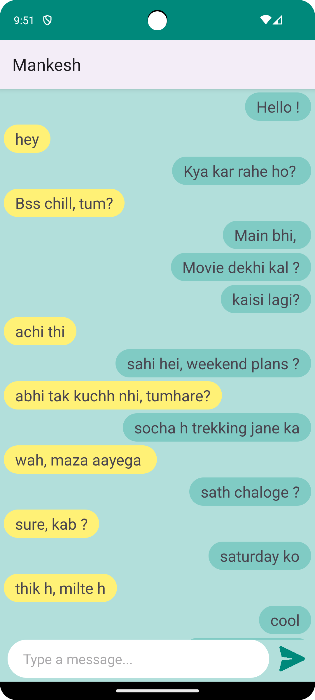

# ChattingApp

ChattingApp is an Android messaging application built with Kotlin and Firebase Cloud Firestore for real-time messaging capabilities.

## Key Features

- Real-time messaging with friends.
- Firebase authentication for secure user login/signup.
- Firestore database for storing chat messages.
- Clean and intuitive user interface optimized for a seamless chatting experience.

## Screenshots

  
  

## Technologies Used

- **Platform:** Android (Kotlin)
- **Backend:** Firebase Cloud Firestore

## How to Use

1. Clone the repository:

2. Open the project in Android Studio.

3. Connect the project to your Firebase project by following the Firebase setup instructions.

4. Build and run the app on an Android device or emulator.
